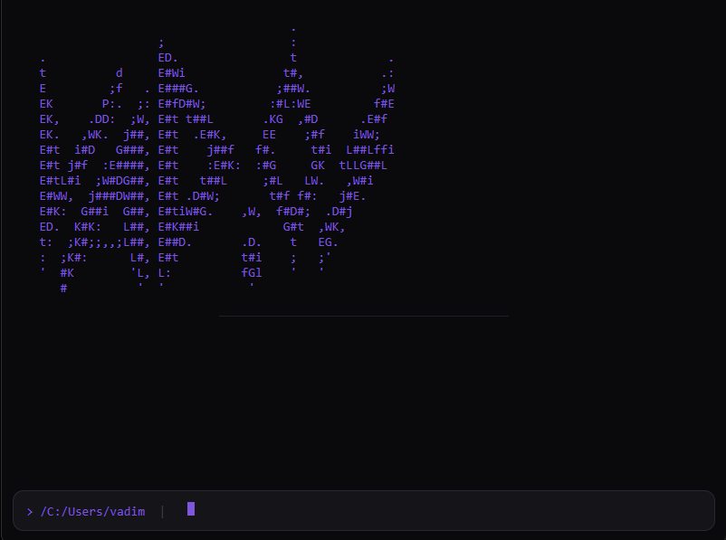
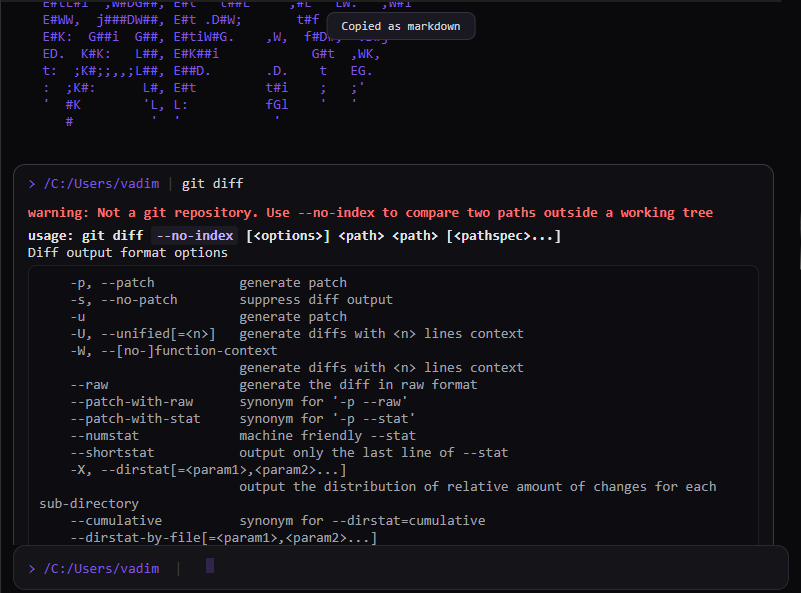
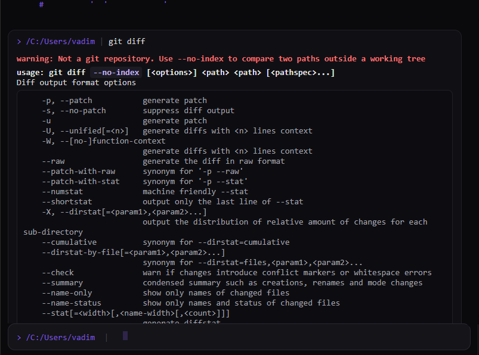

# VAD/OS

**Status:** In development — command boundaries working, block renderer in progress.





A cross-platform terminal for Windows and Linux that renders command output as structured markdown blocks instead of a raw text stream.

## Why

Existing terminals split along OS lines — the ones that feel good on Linux often don't exist or don't feel native on Windows, and vice versa. On top of that, raw terminal output is hard to scan: commands, logs, and results blur together with no visual separation.

VAD/OS solves both at once: one terminal, same experience on both platforms, with output that's actually readable.

## What it does

- **One terminal, both platforms.** Identical functionality and visuals on Windows and Linux. No feature gaps, no "works better on X."
- **Markdown-structured output.** Every command becomes a distinct block instead of a wall of text:
  - The command renders as a `#` heading, preceded by a `---` divider.
  - Running output (downloads, progress bars, spinners) is contained in a live-updating fenced code block, so it can't break the layout.
  - On completion, a closing `##` heading shows the result — green for success, red for failure — followed by a `---` divider.
- **Typewriter reveal.** Output animates in row by row as it arrives, with hard flood control so a `npm install` never falls behind reality.
- **Modern, intentional styling.** Dark theme, muted accent colours, thin rounded borders. A terminal that looks designed, not default.
- **Font choice.** Three selectable fonts: System (OS default), Mono (standard monospace), and Modern (Claude Sans Modern).
- **Full-screen app compatibility.** Programs that take over the screen (`vim`, `htop`, `claude`) fall back to a raw xterm.js view at native speed. Markdown rendering applies only to standard command output.

## How it works

Two renderers over one PTY stream:

- **Block renderer** (default) — plain DOM, one `<section>` per command. This is what gets styled and animated.
- **xterm.js** (fallback) — mounted only on alt-screen enter, for full-screen TUI apps. Raw passthrough, never intercepted, never animated.

Command boundaries come from **OSC 133** shell integration, injected at spawn rather than by editing your dotfiles. Rust is a dumb pipe: it streams raw bytes and parses nothing, because a marker delivered out-of-band from the bytes around it arrives out of order and files output under the wrong command.

**Stack:** Tauri v2 · SvelteKit (SPA) · portable-pty · xterm.js · GSAP

## Performance

A terminal is used hundreds of times a day, so animation and block chrome are not allowed to cost anything you can feel. The project runs against a fixed budget table — 8 ms keystroke-to-glyph, 40 MB/s sustained throughput, 0.0 % idle CPU, bounded RSS across a full day of scrollback — measured against Windows Terminal and Alacritty on the same machine.

The rules that keep it there (IPC coalescing, scrollback virtualization, no per-line allocation in the hot path) are binding, not advisory. See [PERFORMANCE.md](PERFORMANCE.md).

## Shells

bash, zsh, fish, and PowerShell are the initial targets. Beyond those, shells are tiered by how much OSC 133 marker fidelity they can provide — Nushell has it natively, tcsh and Xonsh have full prompt hooks, POSIX shells like dash and ksh get a degraded path, and `cmd.exe` can never report exit codes at all. See [.claude/docs/shells.md](.claude/docs/shells.md).

## Build

Requires the [Tauri v2 prerequisites](https://tauri.app/start/prerequisites/) — Rust toolchain, and WebView2 on Windows (preinstalled on Windows 11).

```bash
npm install
npm run tauri dev
```

To produce a real installable app:

```bash
npm run tauri build
```

This writes three artifacts under `src-tauri/target/release/`:

| Artifact | Path |
|---|---|
| Standalone executable | `vados.exe` |
| Windows installer | `bundle/nsis/vados_0.1.0_x64-setup.exe` |
| MSI package | `bundle/msi/vados_0.1.0_x64_en-US.msi` |

On Linux the same command produces an AppImage and a `.deb` under `bundle/`.

The installer adds a Start menu entry, desktop shortcut, and uninstaller. The bare `vados.exe` also runs on its own, but needs the `resources/` directory beside it — that's where the shell integration snippets live.

Builds are unsigned, so Windows SmartScreen will warn on first run until a code-signing certificate is added.

## Non-goals

- Replacing full TUI rendering for alt-screen applications. Those get a real terminal, deliberately.
- Multiple tabs. People open a second window instead.
- A plugin system. Settings are a fixed, curated GUI, not an extension surface.
- Real containerisation. Commands run on the host; "container" here means the UI-level fenced block that isolates live output.

## Documentation

| Doc | Purpose |
|---|---|
| [.claude/docs/README.md](.claude/docs/README.md) | Index of all working docs and phase plans |
| [.claude/docs/architecture.md](.claude/docs/architecture.md) | Stack and the dual-renderer design |
| [.claude/docs/decisions.md](.claude/docs/decisions.md) | Settled decisions and the reasoning behind them |
| [.claude/docs/tasks.md](.claude/docs/tasks.md) | Live backlog |
| [ANIMATION.md](ANIMATION.md) | Binding animation rules |
| [PERFORMANCE.md](PERFORMANCE.md) | Binding performance budgets and rules |

---

**Last updated:** 2026-08-05
