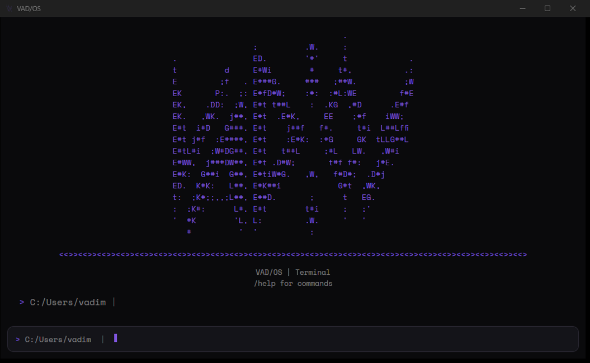
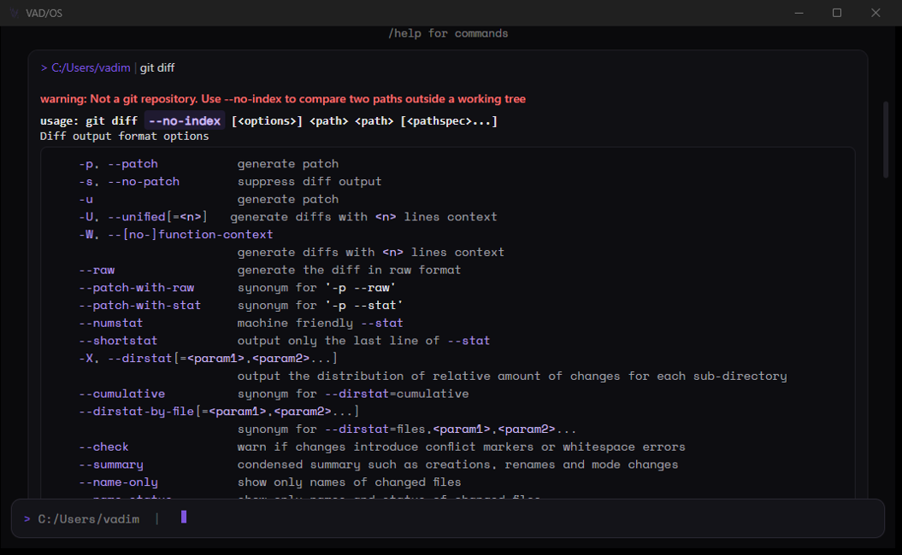
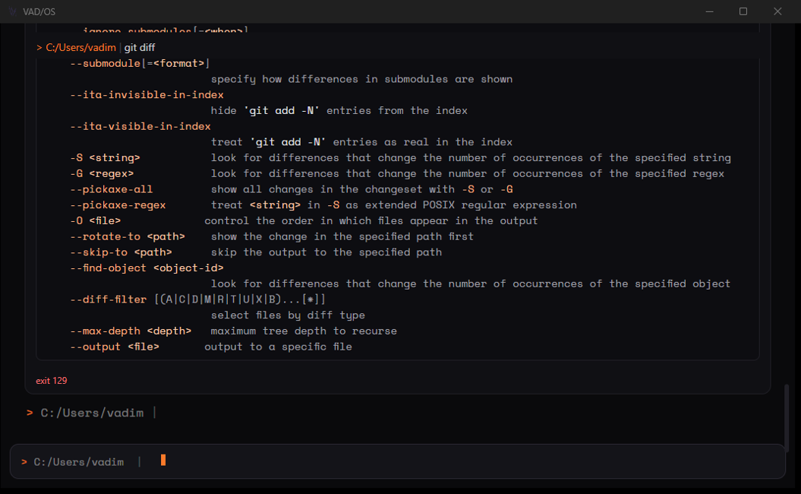
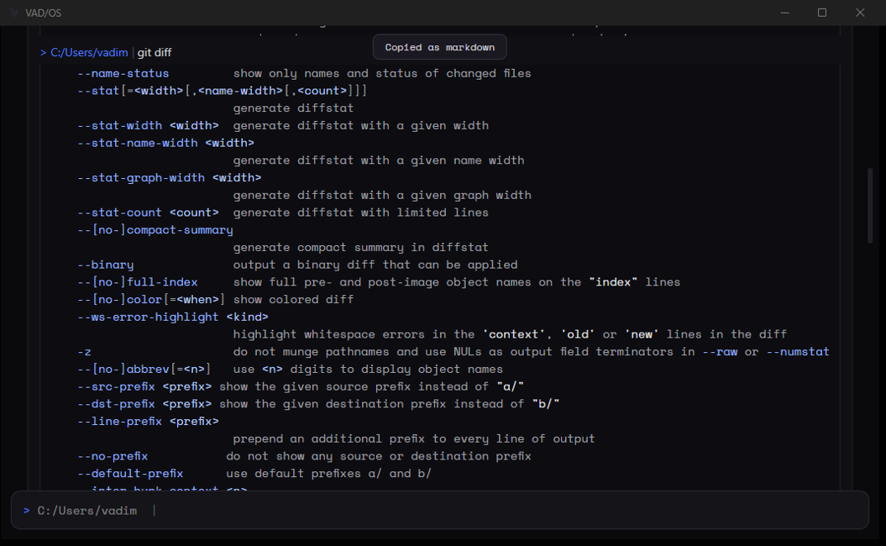
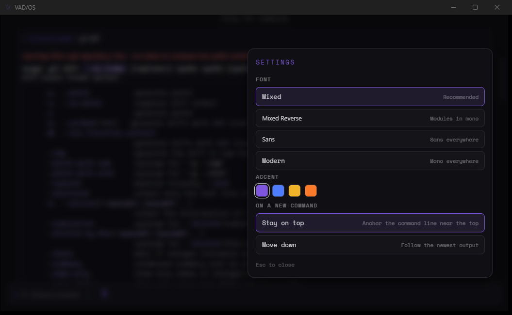

# VAD/OS

A cross-platform terminal for Windows and Linux that renders command output as structured markdown blocks instead of a raw text stream.

## Demo

<!-- demo:start -->

<!-- demo:end -->

## What it does

- **Any shell.** PowerShell, bash, and zsh work today. [WSL distributions, Git Bash, `cmd`, fish, Nushell, tcsh, Xonsh, dash, ksh, or any binary you point it at.]
- **One terminal, both platforms.** Identical functionality and visuals on Windows and Linux. No feature gaps, no "works better on X."
- **Markdown-structured output.** Every command becomes a distinct block instead of a wall of text: the command renders as a `#` heading behind a `---` divider, running output (downloads, progress bars, spinners) sits in a live-updating fenced code block so it can't break the layout, and completion closes it with a `##` heading — green for success, red for failure.
- **Typewriter reveal.** Output animates in row by row as it arrives, with hard flood control so a `npm install` never falls behind reality.
- **Dark theme, muted accent colours, thin rounded borders.**
- **Font modes.** Not a font picker — a rule about where each font applies. **Mixed** (default) puts mono outside modules and sans inside them; **Mixed Reverse** swaps that; **Sans** and **Modern** apply one font throughout. Code blocks, inline code, ASCII banners, and the raw view stay monospace in every mode, because alignment is load-bearing there.
- **Sticky command lines.** When a block's output runs taller than the screen, the command line that produced it pins to the top, so you always know what you're looking at.
- **Full-screen app compatibility.** Programs that take over the screen (`vim`, `htop`, `claude`) fall back to a raw xterm.js view at native speed. Markdown rendering applies only to standard command output.
- **Every block can be toggled back to its raw bytes.** If the renderer gets something wrong, one keystroke undoes it.
- [**Live markdown rendering** with interactive code blocks: copy, or run after an explicit confirmation showing exactly what will be sent.]
- [**Collapsible output**, with stack traces folded to the frames that matter.]
- [**Mermaid diagrams, images, and video** rendered inline in the block that printed them.]
- [**AI output that reads like documentation.** `claude` and friends emit markdown into terminals that cannot show it. This one will.]
- [**Split view** — rendered on one side, raw terminal on the other, so you can always see what was actually printed.]
- [**Export** any block or a whole session to Markdown, HTML, or PDF.]
- [**Themes as data** over a fixed token contract, hot-reloaded from a file.]

## Why

Existing terminals split along OS lines — the ones that feel good on Linux often don't exist or don't feel native on Windows, and vice versa. On top of that, raw terminal output is hard to scan: commands, logs, and results blur together with no visual separation.

VAD/OS solves both at once: one terminal, same experience on both platforms, with output that's actually readable. Markdown is entered on evidence — a program declaring it, or a detector clearing a high bar — never assumed, so plain and ANSI output still renders exactly as it is.

## Performance

A terminal is used hundreds of times a day, so animation and block chrome are not allowed to cost anything you can feel. The project runs against a fixed budget table — 8 ms keystroke-to-glyph, 40 MB/s sustained throughput, 0.0 % idle CPU, bounded RSS across a full day of scrollback — measured against Windows Terminal and Alacritty on the same machine.

---

**Last updated:** 2026-08-06
