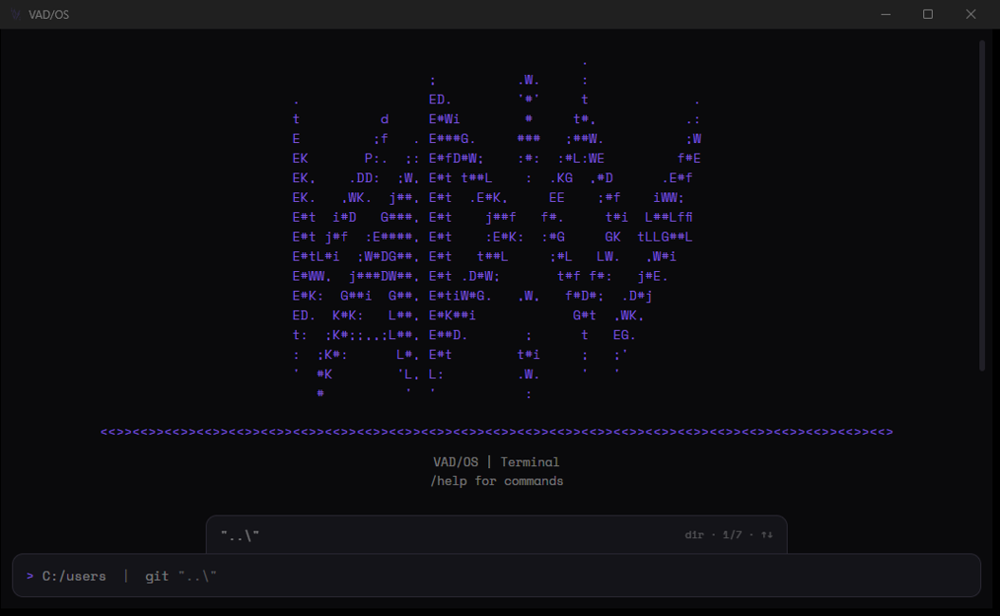
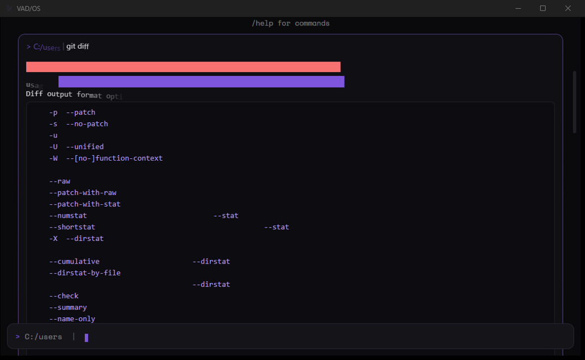
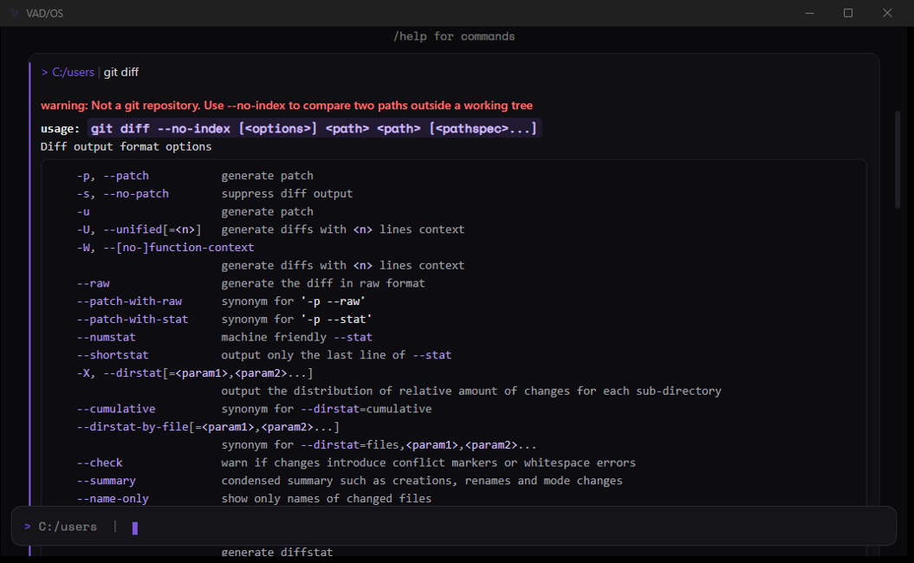
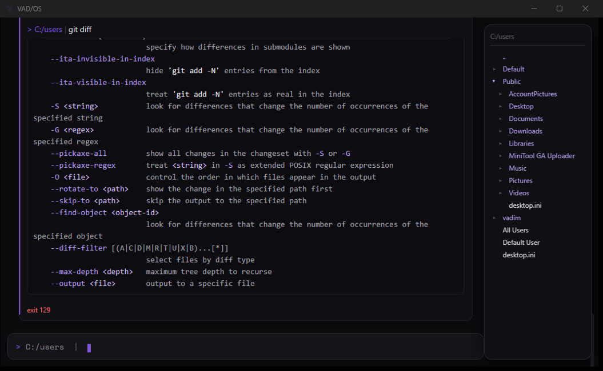
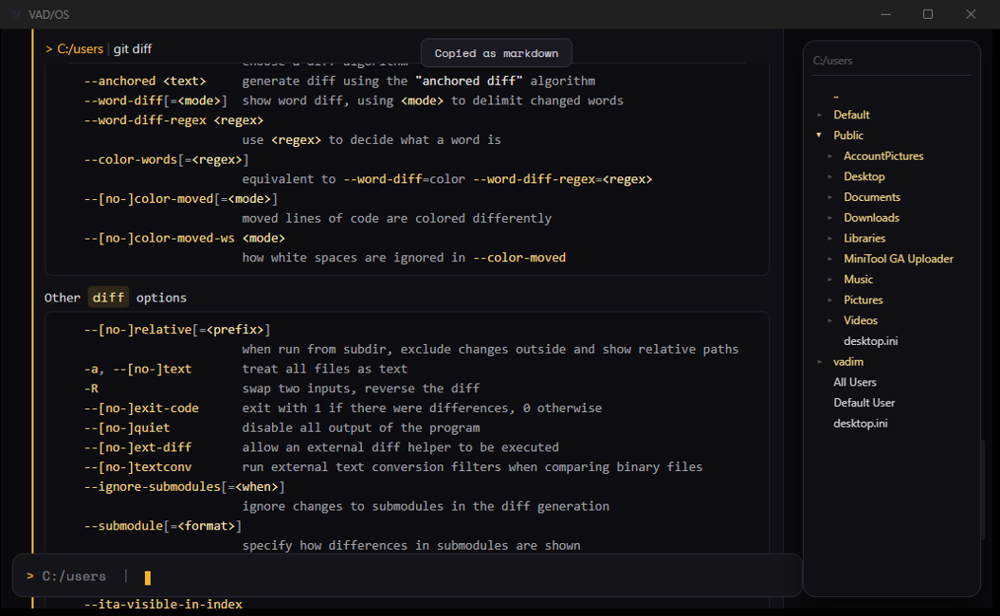

# VAD/OS

A cross-platform terminal for Windows and Linux that renders command output as structured markdown blocks instead of a raw text stream.
Solves problems with Terminals you have never asked for.

## Demo

<!-- demo:start -->

<!-- demo:end -->

## Status

**Pre-1.0 and under active development. Nothing here is stable, and one common case is broken; see *Known broken* below.** It is developed on Windows; the Linux half has never been run.

## What works

- **Structured output.** Each command becomes its own block: a head carrying the working directory and the command line, the output parsed into headings, lists, code blocks and inline code, and a result line on completion, green for success and red for failure. The parser emits nodes rather than a markup string, so command output can never be read as markup.
- **Markdown on evidence, never assumed.** Full markdown is entered only when a program declares it (a reader command printing a `.md` file) or the text clears a high bar on its own. Plain and ANSI output renders exactly as it is.
- **Reveal animation.** A bar sweeps each coloured token in order of how much it means, and a character wave rises under the grey prose between them. Off-screen output is not animated, and long output degrades to a coarser unit rather than falling behind. `Instant` in the settings turns it down to a single rise per element.
- **Font modes.** Not a font picker, a rule about where each font applies. **Mixed** (default) puts mono outside modules and sans inside them; **Mixed Reverse** swaps that; **Sans** and **Modern** apply one font throughout. Code blocks, inline code, ASCII banners and the raw view stay monospace in every mode, because alignment is load-bearing there.
- **Settings panel** on Esc: font mode, accent colour, scroll behaviour, reveal mode, startup directory. Stored in `config.toml`, which is watched. An external edit applies without a restart.
- **Sticky command lines.** When a block's output runs taller than the screen, the command line that produced it pins to the top.
- **Input completion.** A suggestion strip above the prompt with ghost text inline: this session's history, a curated command list, and the contents of the directory being typed. Tab or → takes it; Enter always runs the line.
- **Block selection and copy.** Ctrl+Up/Down or a click selects a past block; Ctrl+Shift+C copies its output and Ctrl+Shift+M copies it as markdown. Right-click does the same two.
- **A folder panel** on Ctrl+B, as a tree on the right. It takes width from the terminal rather than covering it, so the shell keeps wrapping where the text ends. Click to expand, shift+click to put `cd` at the prompt, click a file for the ways to run it, and drag a file out into any other application. It never moves, renames or edits anything.
- **Files dropped on the window** offer the same choices as a file clicked in the panel.
- **`open <path>`** opens a file or folder in whatever the system opens it with. `help` lists every command and key.
- **Full-screen apps.** `vim` and `htop` hand over to a raw xterm.js view at native speed, and nothing is intercepted or animated there.

## Known broken

- **`claude` and other inline TUIs render as a prompt with no interface.** The raw-view switch triggers on the alternate screen, and Ink-based apps do not use it, they repaint in place, so the block renderer reads back a buffer being overwritten many times a second. Most modern Node TUIs are in this category; `vim` and `htop` are the easy case. Fixing it is a design decision about what else should trip raw mode, not a patch.
- **`git diff` through its pager lands as a screenshot of `less`**, right-truncation markers and all, for the same reason. `git --no-pager diff` is the workaround.
- **A block cannot yet be toggled back to its raw bytes.** Every block *keeps* the bytes it rendered from. There is no key that shows them yet.

## Not built yet

- One terminal, both platforms: identical on Windows and Linux, no feature gaps. Linux has never been run.
- Shells beyond PowerShell, bash and zsh, WSL, Git Bash, `cmd`, fish, Nushell, or any binary you point it at.
- Interactive code blocks: copy, or run after an explicit confirmation showing exactly what will be sent.
- Collapsible output, with stack traces folded to the frames that matter.
- Mermaid diagrams, images and video rendered inline in the block that printed them.
- Split view, rendered on one side, raw terminal on the other.
- Export of a block or a session to Markdown, HTML or PDF.
- Themes as data over a fixed token contract, hot-reloaded from a file.

## Why

Existing terminals split along OS lines, the ones that feel good on Linux often don't exist or don't feel native on Windows, and vice versa. On top of that, raw terminal output is hard to scan: commands, logs, and results blur together with no visual separation.

VAD/OS solves both at once: one terminal, same experience on both platforms, with output that's actually readable. Markdown is entered on evidence, a program declaring it, or a detector clearing a high bar, never assumed, so plain and ANSI output still renders exactly as it is.

## Performance

A terminal is used hundreds of times a day, so animation and block chrome are not allowed to cost anything you can feel. The project holds a fixed budget table. 8 ms keystroke-to-glyph, 40 MB/s sustained throughput, 0.0 % idle CPU, bounded RSS across a full day of scrollback, against Windows Terminal and Alacritty on the same machine. **These are the targets the code is written against, not measurements that have been taken.** The comparison run has not happened.

---

Everything is tested opposed to Windows Terminal, maintaining most know behaviours.

**Last updated:** 2026-08-08
